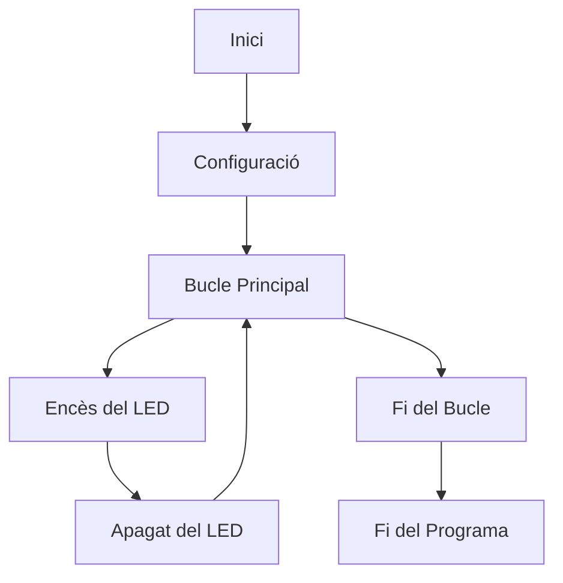

# INFORME PRACTICA 1 -  BLINK 

*En la practica 1 hem realitzar la primera presa de contacte amb la placa la qual treballarem i hem analitzat el programa penjat a la pràctica*

1. Seguidament l'hem modificat per poder incluir l'enviament de dades de "ON" i "OFF" inicialitant el port serie i enviant les dades cada vegada que cambiava l'estat del LED.
2.  Tambe ha sigut modificat per a que actui directament sobre els registres dels ports d'entrada i de sortida.

**CODI :**

A continuacio esta el codi final de la la pràctica 1
```
#include <Arduino.h>

#define LED_BUILTIN 23
#define DELAY 1000

uint32_t *gpio_out = (uint32_t *)GPIO_OUT_REG;

void setup() {
  pinMode(LED_BUILTIN, OUTPUT);
  pinMode(21, OUTPUT);
  Serial.begin(115200);
}
void loop() {
  //digitalWrite(LED_BUILTIN, HIGH);
  digitalWrite(21, LOW);
  *gpio_out |= (1 << 23);
  Serial.println("ON"); 
  delay(DELAY);
  //digitalWrite(LED_BUILTIN, LOW);
  digitalWrite(21, HIGH);
  *gpio_out ^= (1 << 23);
  Serial.println("OFF"); 
  delay(DELAY);
}
```
___

**Diagrama de Flujo del Código**

Aquest seria per mi, amb el que he entes, el diagrama de flux.



___

**Diagrama de temps**

He intentar fer el diagrama de temps en el format indicat pero no m'en he ensortit, per tant l'he realitzat en format taula.

| Tiempo (ms) | Estat Inicial | Estat LED (Pin 23) | Estat Pin 21 |
|-------------|-----------------|---------------------|---------------|
| 0           | LOW             | HIGH                | LOW           |
| 1000        | HIGH            | LOW                 | HIGH          |
| 2000        | LOW             | HIGH                | LOW           |
| 3000        | HIGH            | LOW                 | HIGH          |
| ...         | ...             | ...                 | ...           |

___

El punt 6 del Guió de la Pràctica, fa la seguent pregunta:
>En el programa que s'ha realitzat, quin es el temps lliure que te el processador?

*La resposta:*
Observant el temps que el processador no està ocupat executant instruccions específiques del programa.
En en nostre programa hi han crides de la funcio de'delay(DELAY) les que faran que s'aturi l'execució del programa durant el temps introduït.
```
#define DELAY 1000
```
Quan fa la crida, les instruccions princils sera la d'escritura en pins digitals 'digitalWrite' i operacions en elregistre deGPIO 'gpio_out'.

***FI DE LA PRACTICA 1***